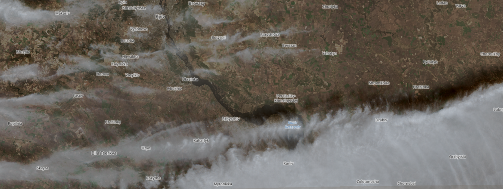
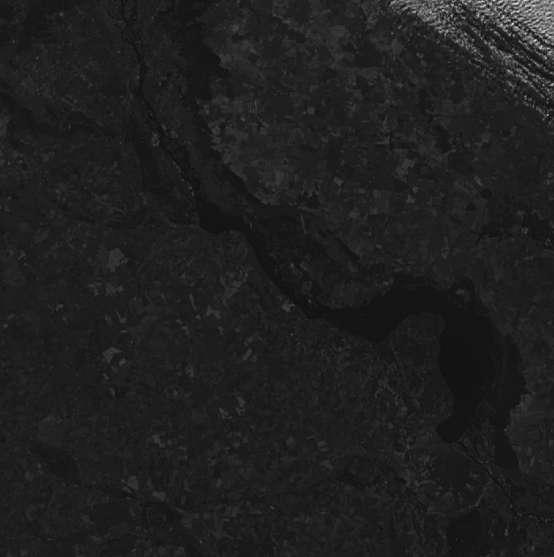
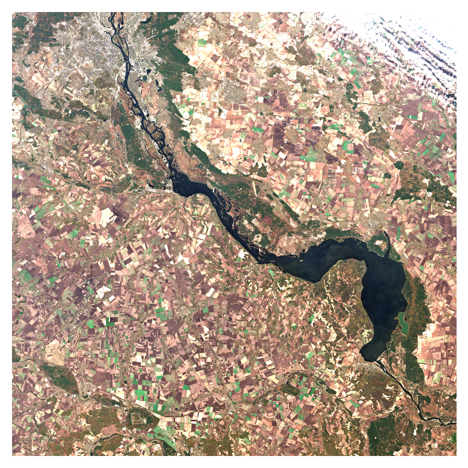
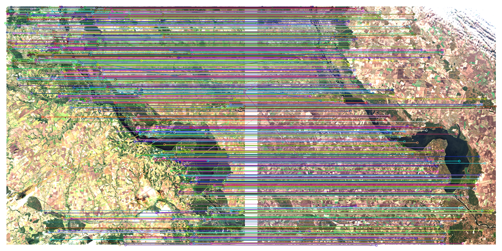

# Image Matching with SIFT and BFMatcher
This project demonstrates how to use the Scale-Invariant Feature Transform (SIFT) algorithm along with Brute-Force Matcher (BFMatcher) to find keypoints and match images based on feature similarities. The model can be used to compare images from different seasons or conditions and is capable of visualizing matching keypoints and corresponding matches.

## Features
- SIFT (Scale-Invariant Feature Transform): Detects and describes local keypoints in an image.
- BFMatcher (Brute-Force Matcher): Matches the keypoints between two images based on their descriptors.
- Image Visualization: Visualizes the image matches using OpenCV and saves the output image.
- Color Image Support: The model supports working with color images.

## Project Structure
```
Image-Matching-With-SIFT/
│
├── data/                              # Folder to store input images (raw)
│   ├── 2024_august/                   # Folder for raw August images (e.g., JP2 or TIFF files)
│   └── 2024_november/                 # Folder for raw November images (e.g., JP2 or TIFF files)
│
├── 2024_august_png/                   # Folder for preprocessed August images (e.g., PNG)
├── 2024_november_png/                 # Folder for preprocessed November images (e.g., PNG)
│
├── notebooks/                         # Folder to store Jupyter notebooks
│   ├── data_prepare.ipynb             # Jupyter notebook for preparing and preprocessing the dataset
│   ├── demo.ipynb                     # Jupyter notebook for the demo (showing keypoints and matching)
│
├── output/                            # Folder to store output images and results
│   └── output_matches.png             # Image with visualized keypoints and matches
│
├── inference.py                       # Python script for running inference (matching two images)
├── model.py                           # Python script for image matching (model with SIFT, BFMatcher)
├── requirements.txt                   # List of dependencies to install
├── README.md                          # Project documentation (this file)
└── LICENSE                            # Optional: License file for your project
```
## Requirements
### To run this project, you need the following libraries:

- opencv-python – For image processing and keypoint detection.
- matplotlib – For visualizing the matching results.
- numpy – For numerical operations.
### You can install these dependencies by running:
```
pip install -r requirements.txt
```
# How to Use
### Download data 
- Photo of your object in  diferent seasons  (for example [Copernicus](https://browser.dataspace.copernicus.eu/?zoom=5&lat=50.14875&lng=20.76416&themeId=DEFAULT-THEME&visualizationUrl=U2FsdGVkX18GQiWj4lEjhw5KOcfI%2F%2FmgLlge9RNTlzBNHYtXTHWLDhCH1XHhGPGqHuB9XP0HCIqXaxsX5j%2Bep0AEfsFHd%2FGwG0bl7KOKpfqanLEIDx8mYbfUKc3zSexY&datasetId=S2_L2A_CDAS&demSource3D=%22MAPZEN%22&cloudCoverage=30&dateMode=SINGLE))
###  Prepare Your Images: 
- Place the images you want to compare (e.g., from different seasons) in the data/ folder. These images should be in .png or .jpg format.
```python
def jp2_to_png(fp_in,fp_out,prefix):
    bandList = [band for band in os.listdir(fp_in) if band.endswith('.jp2')]

    for band in bandList:
        jp2_path = os.path.join(fp_in, band)  # Full path for the input JP2 file
        in_image = gdal.Open(jp2_path)
    ...
    rgb_plot=plt.imshow(rgb_composite_bn, interpolation='lanczos')
    plt.axis('off')
    image_path = os.path.join(fp_out,'november.png')
    plt.savefig(image_path, dpi=200, bbox_inches='tight')
    plt.close('all')
    

prefix = "2024_november\T36UUA_20241107T090059_"
fp_out = "2024_november_png"
fp_in = "2024_november"
img_1 = jp2_to_png(fp_in,fp_out,prefix)
```


<p align="center">
  <figure style="display:inline-block; margin-right: 20px;">
  
  <figcaption style="text-align: center;font-size: 20px;">To prepare</figcaption>
</figure>
  <figure style="display:inline-block; margin-right: 20px;">
  
  <figcaption style="text-align: center;font-size: 20px;">After prepare</figcaption>
</figure>
</p>

### Run the Model:

- Run the model.py script. It will automatically load the images, detect keypoints, and match them using SIFT and BFMatcher.
- The matching results will be saved as an output image (output_matches.png), which shows the corresponding keypoints and lines connecting matched points between the images.

```
model.py
```
## Example Usage
Here’s a code snippet that demonstrates the process of matching two images:
```python 
import cv2
import matplotlib.pyplot as plt

# Load images
img1 = cv2.imread('data/august.png')
img2 = cv2.imread('data/november.png')
......
# Initialize SIFT detector
sift = cv2.SIFT_create()

# Detect keypoints and descriptors
kp1, des1 = sift.detectAndCompute(img1, None)
kp2, des2 = sift.detectAndCompute(img2, None)

# Save the result
cv2.imwrite('output/output_matches.png', img_matches)


```
## Link for model weights [Huggingface](https://huggingface.co/VolodymyrKyba/SIFT_BFMatcher_Model/tree/main)


## This will output an image showing the matched keypoints with lines connecting them, which can be saved and viewed.

## Notes
- The model uses SIFT for feature extraction and BFMatcher to find the best matches between keypoints.
- The matching process is based on finding similar keypoints in both images, even if they have different orientations or are captured under different conditions (e.g., different seasons).
- You can modify the parameters for keypoint matching to adjust the sensitivity (e.g., max_distance or ratio_test threshold).
## License
This project is licensed under the MIT License – see the LICENSE file for details
